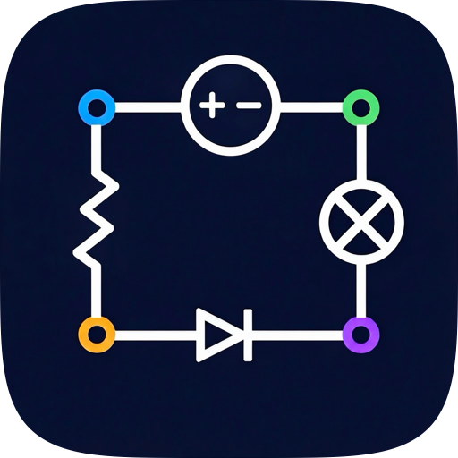
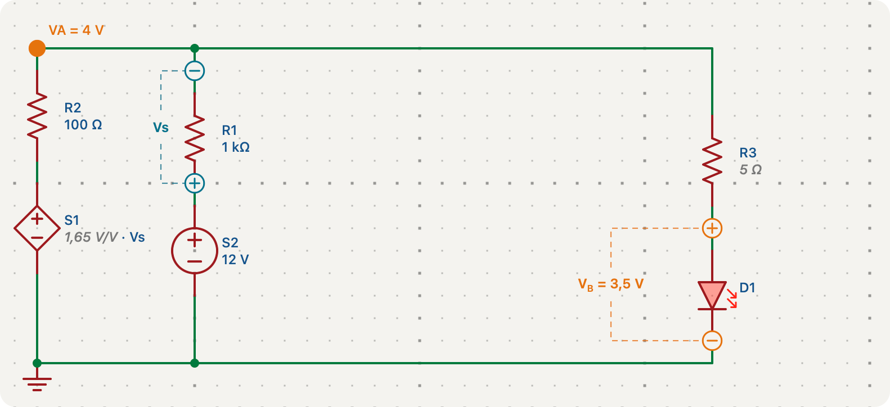

<p align="center">
  
</p>

<h1 align="center">JouleSketch</h1>

<p align="center">
  <b>Tegn et kredsløb – og få resten regnet ud.</b><br>
  Spændinger, strømme, effekter og manglende komponentværdier, trin-for-trin-gennemgange og Maple-kode til afleveringen.
</p>

<p align="center">
  
  
  
  
</p>

<p align="center">
  <a href="#funktioner">Funktioner</a> ·
  <a href="#genvejstaster">Genvejstaster</a> ·
  <a href="#kom-i-gang">Kom i gang</a> ·
  <a href="#opbygning">Opbygning</a>
</p>

<p align="center">
  
  <br>
  <sub>Skriv de spændinger, du vil have – V<sub>A</sub> = 4 V og V<sub>B</sub> = 3,5 V over lysdioden – og JouleSketch finder komponentværdierne: forstærkningen i S1 og R3 vises med grå kursiv.</sub>
</p>

## Hvad kan den?

<table>
  <tr>
    <td width="33%" valign="top">
      <h3>✏️ Tegn</h3>
      Komponenter, ledninger, stel og målepunkter sætter sig fast på gitteret. Klik for at placere, eller træk fra punkt til punkt.
    </td>
    <td width="33%" valign="top">
      <h3>⚡ Regn</h3>
      Skriv det, du kender – resten findes med det samme. DC, AC med fasorer, PWM, dioder og styrede kilder.
    </td>
    <td width="33%" valign="top">
      <h3>📐 Forstå</h3>
      Knudepunkts-, maske- og superpositionsmetoden trin for trin, og Maple-kode, der er klar til at sætte ind i opgaven.
    </td>
  </tr>
</table>

Der er to versioner, som bygger på den samme kode:

| Version | Platform | Hvor |
|---|---|---|
| 🖥️ App | Mac (macOS 15+) og iPad (iPadOS 18+) | `JouleSketch.xcodeproj` (SwiftUI) |
| 🌐 Web | Windows og alle andre computere, i browseren | `Web/` (Swift → WebAssembly) |

Begge versioner har en indbygget guide, **Sådan bruger du JouleSketch** (i menuen ⋯ Visning på Mac/iPad og ⓘ på web), som gennemgår hele programmet.

## Funktioner

### Tegning
- **Komponenter:** modstand, kondensator, spole, spændingskilde, strømkilde,
  signalgenerator, kontakt, trykknap, diode, lysdiode (LED) og de fire styrede kilder (spændingsstyret og strømstyret spændings- og
  strømkilde).
- **Ledninger** med støttepunkter. Komponenter kan placeres med et klik eller
  trækkes ud mellem to punkter, så retning og placering kommer med med det
  samme.
- **Kontakter og trykknapper:** klik på en kontakt med Vælg-værktøjet for at
  åbne eller lukke den; en trykknap er lukket, mens man holder den nede
  (eller åben, hvis den er sat til normalt lukket, NC).
  Beregningen følger med med det samme.
- **Stel** (0 V), **strømpile** på ledninger, **spændingspunkter** og
  **spændingsfald** mellem to punkter.
- **Maskestrømme**, der vises inde i en maske, med eller mod uret.
- **Effektcirkler** om en eller flere komponenter, som viser den afsatte
  effekt.
- **Samlet modstand** (Req) mellem to valgfrie punkter.
- **Tekstfelter** med almindelig tekst eller matematik i LaTeX, som også kan
  udregnes med enheder.
- **Grupper**, der deler et større kredsløb op i dele i Maple-vinduet.
- Fortryd, kopiér/indsæt, flyt, rotér og markér hele ledninger.
- **Symboleditor** (dobbeltklik eller højreklik på et symbol) til komponenternes værdier, og farvekoder for modstande
  (E-rækkerne efter IEC 60063).

### Beregning
- Løser kredsløbet ud fra de kendte værdier og finder ukendte spændinger,
  strømme, effekter og komponentværdier.
- Med en **signalgenerator** (amplitude, frekvens og fase) regnes kredsløbet
  med fasorer: kondensatorer og spoler får deres impedans, og spændinger og
  strømme vises som amplitude ∠ fase. Uden en signalgenerator regnes der DC,
  hvor en kondensator er en afbrydelse og en spole en kortslutning.
- Signalgeneratoren har en **bølgeform**: sinus eller firkant (PWM med duty
  cycle). Andet end en sinus regnes som middelværdi (fx D · højspænding) og
  grundtone (første Fourier-led, for en firkant (2A/π)·sin(πD)) med fasorer,
  så man kan se, hvor meget der er tilbage af signalet efter fx et RC-filter.
  En firkant sat til 0 V er en **low-side udgang (LSO)**: åben (høj) i duty
  cyclen og trukket til stel resten af perioden, trukket op af resten af
  kredsløbet (fx en pull-up-modstand).
- Dioder og lysdioder regnes med en fast spænding (0,7 V og 2 V som
  standard), og programmet finder selv ud af, om de leder eller spærrer.
- En **beregningsrapport** fortæller, hvad der mangler, og om de kendte
  værdier modsiger hinanden.
- **Study mode** skjuler resultaterne, så man kan regne selv først og stadig
  se, om alt kan beregnes.

### Gennemgange
Trin-for-trin-udregninger med formler, som man kan følge eller bruge som facit:
- **Knudepunktsmetoden** – Kirchhoffs strømlov i hvert knudepunkt med
  strømmene skrevet med Ohms lov.
- **Maskestrømsmetoden** – Kirchhoffs spændingslov rundt i hver maske
  (kræver et plant diagram).
- **Superposition** – hver kilde regnes for sig, og bidragene lægges sammen.

### Maple-eksport
Kredsløbet skrives som Maple-kode efter knudepunktsmetoden: kendte værdier
med enheder, navngivne ligninger, der fungerer som dokumentation i en
opgave, og kun de resultater, man har bedt om, omregnet til fornuftige
enheder. Koden kan kopieres som tekst eller som MathML.

```
with(Units):
unassign(anames(user)):
R1 := 50*Unit('ohm'):
S1 := 12*Unit('V'):
VA := S1:
L1 := (VA - VB)/R2 - I1 = 0:
sol := solve({L1, L2}, {R2, VB}):
assign(sol):
VB := evalf(convert(VB, 'units', 'V'), 4);
```

### Filer
Kredsløb gemmes som `.joulesketch`-filer, som begge versioner kan åbne og
gemme. På Mac åbner hver fil i sin egen fane. Web-versionen gemmer også
løbende i browseren, så intet forsvinder, hvis siden lukkes.

## Genvejstaster

Alle genveje kan ændres under **Indstillinger**. Standard er:

| Tast | Værktøj | Tast | Værktøj |
|---|---|---|---|
| `S` | Vælg | `I` | Strømpil |
| `W` | Ledning | `P` | Spændingspunkt |
| `1` | Modstand | `F` | Effekt |
| `2` | Spændingskilde | `E` | Samlet modstand (Req) |
| `3` | Strømkilde | `M` | Maskestrøm |
| `4` | Diode | `T` | Tekstfelt |
| `5` | Lysdiode | `K` | Gruppe |
| `C` | Kondensator | `L` | Spole |
| `6` | Signalgenerator | `X` | Kontakt |
| `B` | Trykknap | | |
| `G` | Stel | `R` | Rotér / vend retning |
| `U` | Markér hele ledningen | `Esc` | Afslut / tilbage til Vælg |

I et tekstfelt: `⌘T` tekst, `⌘M` matematik (LaTeX), `⌘B` udregn og `⌘U`
indsæt en enhed `[[ ]]`.

## Kom i gang

### Mac og iPad
Åbn `JouleSketch.xcodeproj` i Xcode og kør skemaet **JouleSketch**.

### Web
Se [`Web/README.md`](Web/README.md) for værktøjer og byggevejledning. Kort
fortalt:

```sh
Web/build.sh dev                 # testside på http://localhost:5173
Web/build.sh                     # færdig side i Web/app/dist
docker compose up -d --build     # eller i Docker: http://localhost:8080
```

## Opbygning

Logikken ligger i delte Swift-filer i `JouleSketch/`, som både Mac-appen og
web-versionen bruger. Web-versionen oversætter dem til WebAssembly (listen
står i `Package.swift`), så en rettelse i dem kommer med i begge.

| Del | Filer |
|---|---|
| Kredsløb og filformat | `Circuit.swift` |
| Beregning | `CircuitSolver.swift` |
| Gennemgange | `Walkthrough.swift`, `NodalWalkthrough.swift`, `MeshWalkthrough.swift` |
| Maple og LaTeX | `MapleExporter.swift`, `MapleMathML.swift`, `MathLatex.swift` |
| Redigering og klik på arket | `CircuitEditor.swift`, `SheetInteraction.swift` |
| Tegning af skemaet | `SchematicScene.swift` |
| Genvejstaster | `KeyBindings.swift` |
| Mac/iPad-brugerflade | de øvrige filer i `JouleSketch/` (SwiftUI) |
| Web-brugerflade og bro | `Web/app/src/`, `Web/Bridge/` |

De delte filer bruger kun `Foundation` (og `Observation`), ikke
SwiftUI/AppKit/UIKit. Mac-appen tegner stadig selv i `SchematicCanvas.swift`
og `SymbolRenderer.swift`, så ændringer i tegning og musebevægelser skal
laves begge steder, indtil Mac-appen også bruger `SchematicScene`.

## Udgivelse af web-versionen

Når der pushes til `main`, bygger GitHub Actions
(`.github/workflows/web.yml`) web-versionen som en container og lægger den på
`ghcr.io`. Serveren henter selv den nye version via Watchtower
(`deploy/docker-compose.yml`). Buildet starter kun, når kode eller byggefiler
ændres, ikke ved ændringer i dokumentation som denne fil.
